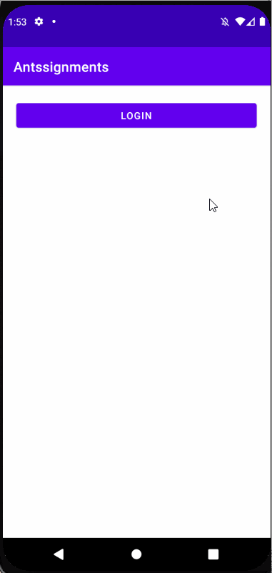
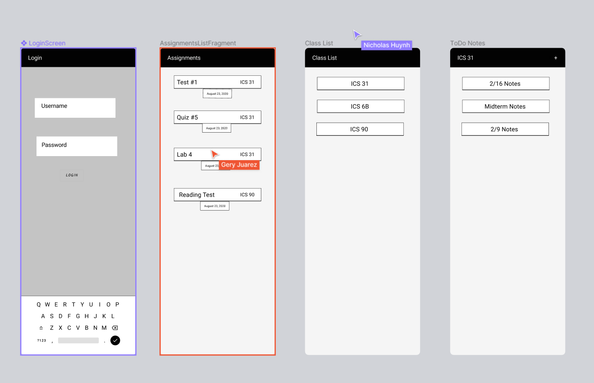

# Antssignments

Unit 8: Group Milestone - README Example
===

# TUNIN

## Table of Contents
1. [Overview](#Overview)
1. [Product Spec](#Product-Spec)
1. [Wireframes](#Wireframes)

## Overview
### Description
A comprehensive app that uses Canvas API to create a todo app for Anteaters' assignments to keep track of and updated on.

### App Evaluation
- **Category:** Education
- **Mobile:** This app would be primarily developed for mobile but would perhaps be just as viable on a computer, to help UCI students keep on track for assignments.
- **Story:** Analyzes users music choices, and connects them to other users with similar choices. The user can then decide to message this person and befriend them if wanted.
- **Market:** Any individual with a UCINetID account could use this app.
- **Habit:** This app could be used often for students to know what is due to plan out their day.
- **Scope:** First we want to start gathering the information from Canvas and putting it onto our front-end, then we want to expand later by adding additional usages of the app such as a list of to-do's for each class.

## Product Spec
### 1. User Stories (Required and Optional)

**Required Must-have Stories**

* [x] User logins to their UCINetID account and accesses Canvas
* [x] User is automatically navigated to their assignments after logging in
* [x] User can navigate through the app via navigation bar
* [x] User is able to click on a class to access a to-do list to enter in reminders and tasks

**Optional Nice-to-have Stories**

* [ ] Calendar implementation to see beyond the current day(s)/week(s) of assignments.

**Story Progress**

 

### 2. Screen Archetypes

* Login 
* Assignments Screen
  * Recycler view of all the assignments from our classes
* Notes Screen
   * Clickable classes lead to another activity in which has all of the notes and reminders for the class

### 3. Navigation

**Tab Navigation** (Tab to Screen)

**Flow Navigation** (Screen to Screen)
* Forced Log-in -> Account creation if no log in is available
* View of all assignments 
* View of all clickable course names
* Clickable course names lead to an individual note fragment with adding/editing/deleting note functionality

## Wireframes
 

## Schema 
### Models
#### Post

   | Property      | Type     | Description |
   | ------------- | -------- | ------------|
   | user          | Pointer to User| Canvas user |
   | assignments   | String     | name of each assignemnt on Canvas timeline |
   | dueAt         | DateTime | date when assignment is due (default field) |
   | className     | String | name of the student's class |

### Networking
#### List of network requests by screen
   - LoginScreen
      - (Read/GET) Get userID UCICanvas information
   - AssignmentsListFragment
      - (Read/GET) Assignments name + date information
   - ClassList
      - (Read/GET) Class names

## Notes
Milestones
* Week One
  * Develop a wireframe for the application in order to brainstorm the overall implementation of the application. Find an API for Canvas that works and has the information required for the application to run. Establish ways of communication and start the project after the planning has been done.
* Week Two
  * Figure out how to implement the API so that we can retreive the information we need for the application. Understand how to API works, how to get a developer key and the scope of that key so that we can come up with a way to design the OAuth login page of the appplication. Create fragments for the assignments and classes so that the application has multiple pages. Design the user interface based off of the wireframe created in week one.
* Week Three
  * Implement the bottom navigation bar to allow the user to rotate between the classes and assignments fragments. Using the navigation bar should allow the user to be able to navigate their way throughout all the details of the application so far. Start on figuring out how to implement the notetaking aspect of the application which allows users to create their own notes for their assignments.
* Week Four
  * Finish note view, allowing user to click on a course name to open up an empty note text that they can add/edit/delete notes on their screen. The notes will save for each class respectably and allow for user to click and look at again at any time.

List of Issues During Development
* Push/Pull and Commit Issues
  * Starting the application and communicating when we were going to commit changes for the application was an issue while we got started. However, as we began to work more efficiently and communicated more frequently, this issue became quickly resolved.
* OAuth Implementation
  * Understanding the Canvas API and the types of information we were going to receive from the API was something that took us a while to figure out. The issue was that we did not have the availability of aa developer key and in order to retreive this, it would require a timely process of asking UCI for a key with a wide enough scope. Therefore, to resolve this issue, we used one person's information to build our application around.
* Bottom Navigation Bar
  * While implementing this feature onto our application, we desired for the bar to hae two distinct features. However, while implementing this crucial design, we came across issues that affected our MainActivity file, causing the application to crash when we tried to navigate through the login screen. This issue has been resolved and the navigation bar can navigate the user to their classes and their assignments.
* Notes/To-Do list 
  * Had problems figuring how to create a new fragment for each respective class and saving to allow user to access each note sheet at any time, to add/edit/delete notes. Resolved by using .txt files to each respective class, saving on user's device storage, accessing each file by using a prefix of class name + ".txt".
* Sorting by due dates
  * Had to figure out a way to sort all of the assignments for all classes into one total list, accessing due date keys for each assignment and sorting them by earliest due date to latest.
